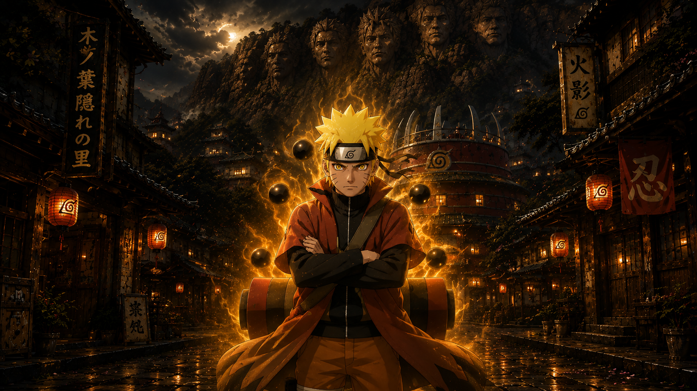
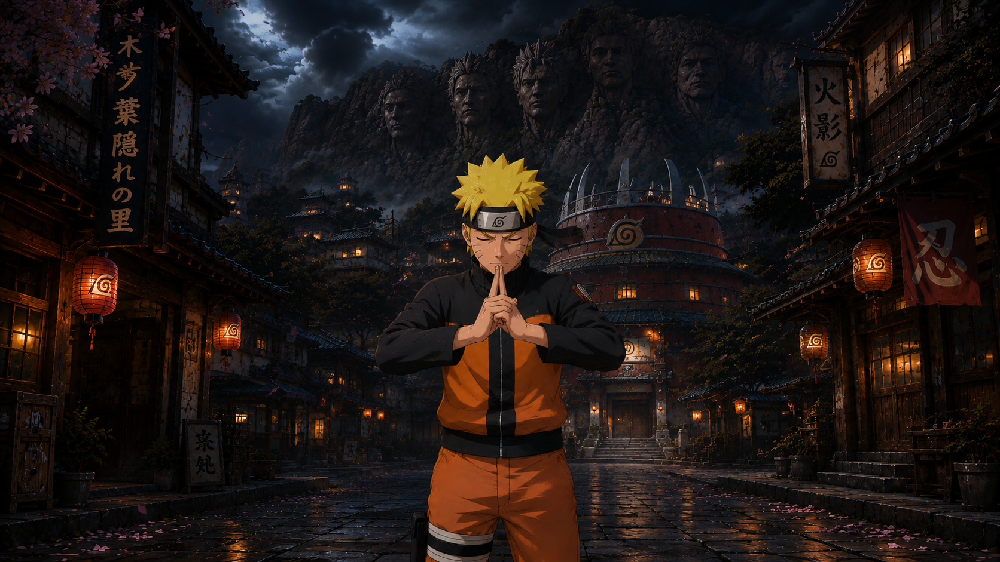
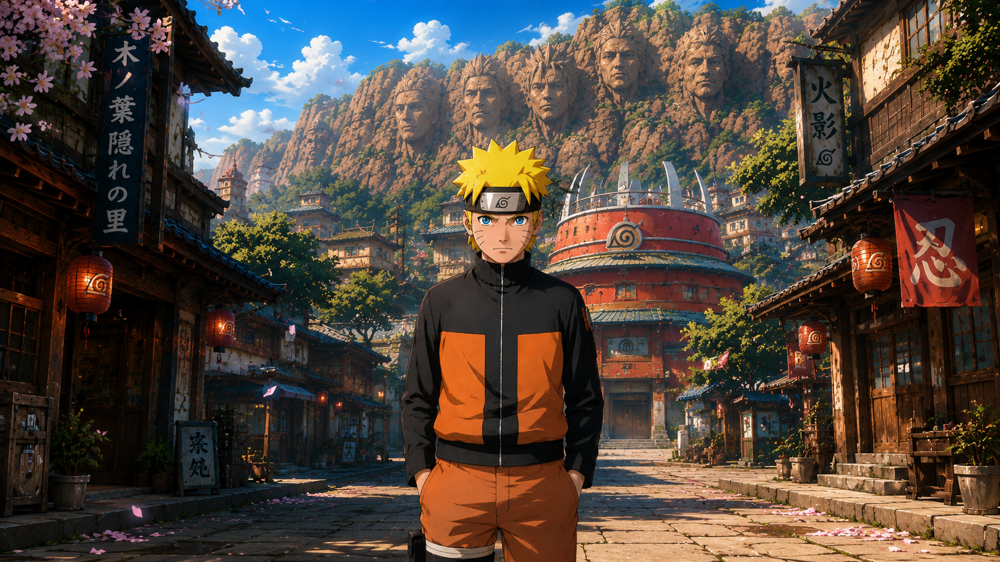

# Naruto — Sage Mode Awakening 🍥⚡

An Awwwards-style single-page experience built around Naruto's transformation from base form to Sage Mode. A cinematic preloader, a video hero with electric ambience, and a pinned scroll-driven **thunder-crack transformation** that sweeps through three forms — Base → Hand Seal → Sage Mode — with jagged lightning cracks, branching bolts, screen flashes, and camera shake.

Built with vanilla HTML/CSS/JS + GSAP ScrollTrigger. Single file, no build step.

---

## Demo

Open `index.html` in a browser (a local server is recommended so the video loads — see Quick start). Scroll slowly through the transformation section to watch the sky answer.

---

## The experience

1. **Preloader** — the brush-stroke NARUTO wordmark stamps in with a 仙人モード kanji line, a "SYNCING CHAKRA" counter fills, a white flash cracks, and the loader wipes away.
2. **Hero** — fullscreen video under a dark cinematic shade, giant "UZUMAKI / NARUTO" brush-font title (per-letter 3D stagger reveal, mouse parallax, electric letter flickers), vertical kanji rails, rising chakra particles, a live HUD frame with clock and signal readout, and ambient thunder flickers every few seconds.
3. **Bolt divider** — a jagged lightning line that draws itself when scrolled into view.
4. **Transformation (pinned, 360vh of scroll)** — three stacked images with two distinct crack transitions:
   - **Crack one** (Base → Hand Seal): a lighter jagged sweep with small cyan crackle bolts — focused, quiet energy.
   - **Crack two** (Hand Seal → Sage Mode): a wilder crack with full-height branching thunder bolts, white flashes, and camera shake on every strike.
   - Captions with mode badges swap per stage; the HUD state runs BASE → FOCUSING → HAND_SEAL → DRAWING_NATURE_ENERGY → SAGE_MODE; ambient motes shift volt-blue → green → warm orange.

Plus the Awwwards staples: film grain overlay, custom cursor ring, `prefers-reduced-motion` support, and mobile responsiveness.

---

## Quick start

Because the page loads a local video file, run it from a small local server rather than double-clicking (browsers block local video/CORS otherwise):

```bash
# any of these, from the project folder:
npx serve .
# or
python3 -m http.server 8000
```

Then open `http://localhost:8000` (or the port shown).

---

## Project structure

```
naruto-sage-awakening/
├── index.html          # everything: markup, styles, scripts
├── video/
│   └── hero.mp4        # your hero video
├── 1.png               # Base form (shown first)
├── 2.png               # Sage Mode (revealed last)
└── 3.png               # Hand Seal (middle stage)
```

---

## Swapping in your assets

**Hero video** — place your file at `./video/hero.mp4`, or edit the `src` on the `<video>` tag. If the file is missing, an animated storm placeholder renders instead so the page never breaks.

**Transformation images** — the three `` tags in the `.morph` section:

```html
  <!-- revealed last -->
  <!-- middle stage -->
  <!-- shown first -->
```

Use the **same aspect ratio and framing** for all three — they stack with `object-fit: cover`, so matched crops make the crack cuts look like one shot transforming.

**Logo & badges** — the preloader wordmark and the three caption badges are base64-embedded PNGs; replace the `src` data URIs to swap them.

---

## Tuning

| What | Where | Default | Effect |
|------|-------|---------|--------|
| Scroll length | `.morph{height:360vh}` | `360vh` | Shorter = faster transformation |
| Transition windows | `T1S/T1E/T2S/T2E` | `0.08–0.42`, `0.56–0.92` | When each crack plays within the scroll |
| Crack jaggedness | `offsets1` / `offsets2` multipliers | `*7` / `*11` | Higher = rougher crack edge |
| Strike frequency | `now-lastStrike>150` | 150ms | Lower = more bolts during crack two |
| Video darkness | `.hero__shade` gradient | 42–92% black | Raise alphas for a darker hero |
| Thunder flicker rate | `setTimeout(ambientFlicker, 2600+…)` | ~2.6–6.8s | Ambient hero flashes |
| Video speed | `vid.playbackRate` | `1` | Set e.g. `0.75` for slow cinematic |
| Title parallax | `nx*26, ny*12` | 26/12px | Mouse-follow drift amount |

---

## How the crack transition works

Each image layer above the bottom one gets a live `clip-path: polygon(...)` — a vertical jagged line built from 22 points with fixed random offsets plus a sine-wave jitter, so the edge crackles like live current. Scroll progress moves the cut left-to-right, erasing the layer to reveal the one beneath. Lightning bolts are generated by recursive midpoint displacement (a straight line repeatedly split and kicked sideways) and drawn in two passes on a canvas — a fat soft glow under a thin bright core — fading over ~12 frames. Flashes and camera shake fire on each big strike.

---

## Tech

- **GSAP 3.12 + ScrollTrigger** (CDN) — preloader timeline, scroll scrubbing, pinning, parallax
- **Canvas 2D** — lightning bolts, chakra particles, motes, video fallback
- **CSS `clip-path`** — the animated crack reveals
- **Google Fonts** — Shojumaru (brush display), Anton, Space Mono, Shippori Mincho, Bebas Neue

No framework, no bundler. Works in current Chrome, Edge, Firefox, and Safari. All motion respects `prefers-reduced-motion`.

---

## Credits & licensing

- Code: free to use and modify for your own projects.
- **Artwork & "Naruto" / characters**: Naruto is created by Masashi Kishimoto; all character art, video, and trademarks belong to their respective rights holders. The images and video here are fan/demo assets — replace them with content you have the right to use before publishing.
- Kanji used: 忍道を貫く (follow your ninja way), 仙人モード (Sage Mode) — standard Japanese; rendering depends on the system/browser CJK font stack.

---

*I never go back on my word. That's my ninja way.* 🦊
